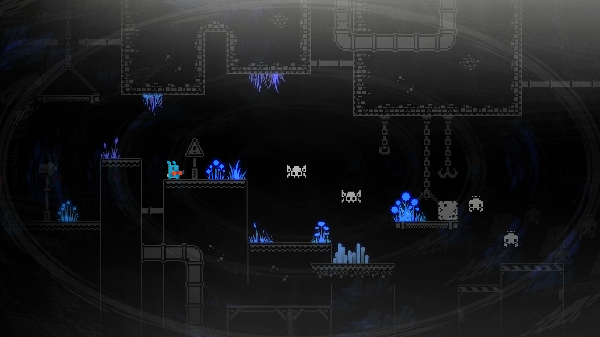

# jMe3GL2 - (jMonkeyEngine3 Graphics Library 2D)

[](https://central.sonatype.com/search?q=jMe3GL2&namespace=io.github.jnightrider)
[](https://opensource.org/license/BSD-3-clause)

jMe3GL2 is a set of classes that can be used to develop a 2D game in jMonkeyEngine3. 
It is a mapping library for JME3 to Dyn4J.



To use jMe3GL2, prior knowledge of how the [JME3](https://jmonkeyengine.org/) graphics 
engine works, as well as the [dyn4j](https://dyn4j.org/) physics engine, is required 
to create wonderful 2D worlds.

**Some features provided by this library:**
1. Creation of 2D models using a *Sprite* mesh.
2. Integration of the Dyn4J engine through *Dyn4jAppState*.
3. Control to manage 2D animations.
4. Support for strongly customized *TileMap*
5. Support for exporting and importing 2D (binary) models.
6. Has a built-in debugger.

## Dyn4j
As mentioned, jMe3GL2 uses Dyn4J as its physics engine. If you are not familiar 
with this topic, we advise you to check out the following resources:

- **[Documentation](https://dyn4j.org/pages/getting-started)**
- **[Samples](https://github.com/dyn4j/dyn4j-samples)**
  
## Requirements
- Java 17 or higher.
- jMonkeyEngine3 version 3.8.1-stable.
- Dyn4J version 5.0.2

## Building with jMe3GL2

jMe3GL2 can be added as a normal dependency using the [stable](https://github.com/JNightRider/jMe3GL2/releases/tag/v3.1.1) 
jar files or using Maven as follows:

**Add the necessary dependencies**

```gradle
    implementation(platform("io.github.jnightrider:jMe3GL2-core:3.1.1"))
    implementation(platform("io.github.jnightrider:jMe3GL2-dyn4j:3.1.1"))
    implementation(platform("io.github.jnightrider:jMe3GL2-jawt:3.1.1"))
    implementation(platform("io.github.jnightrider:jMe3GL2-plugins:3.1.1"))
```

**Starting jMe3GL2**

If this is your first time using jMe3GL2, you can consult some of these resources 
to guide you in using this great library.

- [Complete examples](https://github.com/JNightRider/jMe3GL2-examples)
- [Go to tutorial](https://github.com/JNightRider/jMe3GL2-examples/wiki)
- [Samples](https://github.com/JNightRider/jMe3GL2/tree/master/modules/samples/src/main/java/org/je3gl/demo/core)
